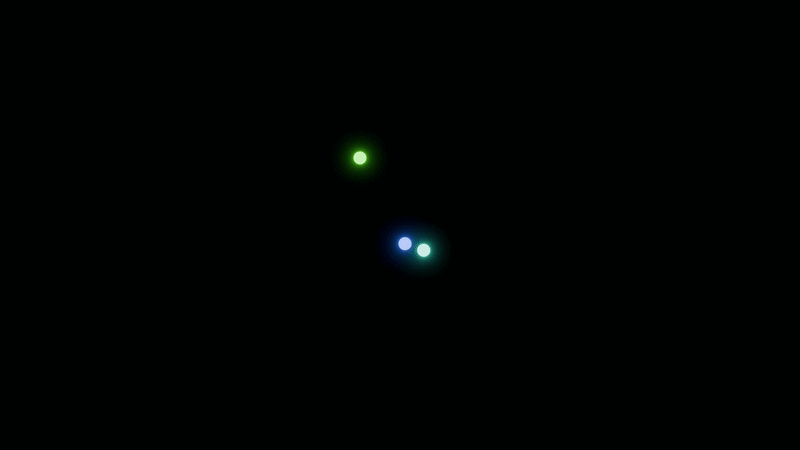
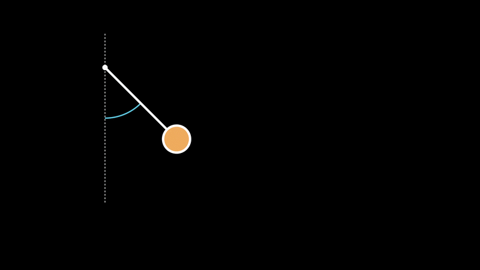

# Numeric Simulations of Physics Problems

This repo contains the source code of most animations from my video on simulating physics Problems. As the series continues this repo will be updates as well.

<p align="center">
  
  &nbsp;&nbsp;&nbsp;
  
</p>

## Watch the Videos here:
<p align="center">
    <a href="https://www.youtube.com/watch?v=M_OOwhA2fY8">
    
    </a>
    <a href="https://www.youtube.com/watch?v=_apHxVJU61g">
    
    </a>
</p>

## Solvers
The methods covered in the video are:
 - Euler Method - in *euler_method.py*
    - Classical Euler
    - Improved/Modified Euler
 - Runge-Kutta - in *runge_kutta.py*
    - Runge-Kutta 4
    - Runge-Kutta 4(5)

"Interactive" versions of these solvers (except RK45) have now also been added. These just return a the y-value at the and instead of the complete list. Meant to be used for interactive simulations such as shown in the Video. 

As a disclaimer: The focus of these implementations are readability over efficiency. For actual usage you should use the solvers of the scipy library.

## Animations
The visualization of the data was done using Manim Community Edition and Blender. It mostly consisted of importing the y- and t-values from the cache transforming them into an interpolated function using *interpolate.interpolate_points*. This way the movement of the body could be driven by a *ValueTracker* serving as the time. See the example below:

```
class SinglePendulum(Scene):
    def construct(self):

        time = ValueTracker()

        cache_path = "single_pendulum.json"
        t_values, y_values = numeric_de_solver.load_chached_result(cache_path)

        pend_func = lambda t: numeric_de_solver.interpolate_points(t, t_values, y_values)

        pend = always_redraw(lambda: 
            Pendulum(
                attach_pos=2*UP+4*LEFT,
                radius=0.4,
                angle=pend_func(time.get_value())[0]
            )
        )

        vert_line = DashedLine(3*UP+4*LEFT, 2*DOWN+4*LEFT, color=GRAY).set_z_index(-1)

        angle_arc = always_redraw(lambda:
            Arc(
                1.5,
                3/2*PI,
                pend_func(time.get_value())[0],
                color=BLUE_C
            ).move_arc_center_to(pend.attach_pos)
        )

        self.add(vert_line, angle_arc, pend)
        t_anim = 40
        self.play(time.animate(run_time=t_anim, rate_func=linear).set_value(t_anim))
        self.wait()

```

<div align="center">
    
</div>

## Interactive Simulations
In the Folder *Interactive Simulations* the source code for the interactive simulations of

 * Springed Double Pendulum (can be pushed)
 * Charged Double Pendulum (interacts with charged mouse cursor)
 * 3 Body Problem (mouse cursor controlls one of the bodies)
 
have been added. You will need to install the pyglet library to run these files.

## Helpful Links
Here are some of the websites, videos, ... that helped me a lot during the making of this video.
 - Quick summary of numerically solving ODEs - [Link](https://www.youtube.com/watch?v=A1JnGhaVJsQ)
 - Explanation of Runge-Kutta Method of Order 2 - [Link](https://www.youtube.com/watch?v=bSs2Sj5Qi8I)
 - Inital values for periodic solutions of the three body problem - [Link](https://www.youtube.com/watch?v=8_RRZcqBEAc)

The Wikipedia links of the used Method can be found in the source code.

 ## Youtube Channels:
  - ## [tamaschque](https://www.youtube.com/@tamaschque) (Main)


  - ## [tama](https://www.youtube.com/@tamasque) (Second)
